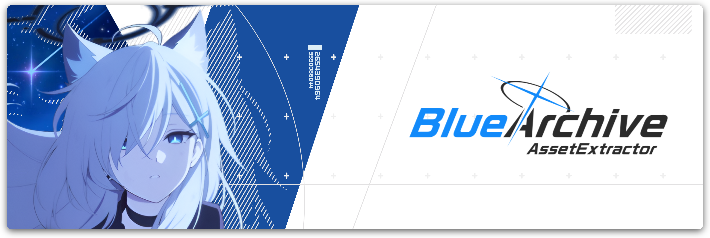

<div>
    
</div>

# Blue Archive - Asset Extractor
A tool and library that extracts **Blue Archive** assets.


> [!WARNING]  
> This is a work in progress project some features are missing 

## Install

### Release
You can download the latest pre-build binaries at [Releases](https://github.com/Deathemonic/BA-AX/releases)

[Windows](https://github.com/Deathemonic/BA-FB/releases/latest/download/baax-windows-x86_64.zip) | [Linux](https://github.com/Deathemonic/BA-FB/releases/latest/download/baax-linux-x86_64.zip) | [MacOS](https://github.com/Deathemonic/BA-FB/releases/latest/download/baax-macos-aarch64.zip)

### Cargo
```shell
cargo install --git "https://github.com/Deathemonic/BA-AX" --locked --release
```

## Usage

Extracting MediaResources
```shell
baax extract media --input some/input/directory/file.zip --output some/output/directory
```

## Building

1. Install [rustup](https://rustup.rs)
2. Clone this repository
```sh
git clone https://github.com/Deathemonic/BA-AX
cd BA-AX
```
3. Build using `cargo`
```sh
cargo build
```

## Library
```toml
baad = { git = "https://github.com/Deathemonic/BA-AX" }
```

### Other Projects
- [BA-AD](https://github.com/Deathemonic/BA-AD): A tool and library that downloads the latest **Blue Archive** assets.
- [BA-MU](https://github.com/Deathemonic/BA-MU): A tool that re-dump AssetBundle for **Blue Archive**.
- [BA-FB](https://github.com/Deathemonic/BA-FB): A tool for dumping and generating **Blue Archive** flatbuffers.
- [BA-CY](https://github.com/Deathemonic/BA-CY): Library for handling **Blue Archive** catalogs, tables, serialization/deserialization, encryption, and hashing.


### Acknowledgement
- [respectZ/blue-archive-viewer](https://github.com/respectZ/blue-archive-viewer)

### Copyright
Blue Archive is a registered trademark of NAT GAMES Co., Ltd., NEXON Korea Corp., and Yostar, Inc.
This project is not affiliated with, endorsed by, or connected to NAT GAMES Co., Ltd., NEXON Korea Corp., NEXON GAMES Co., Ltd., IODivision, Yostar, Inc., or any of their subsidiaries or affiliates.
All game assets, content, and materials are copyrighted by their respective owners and are used for informational and educational purposes only.
